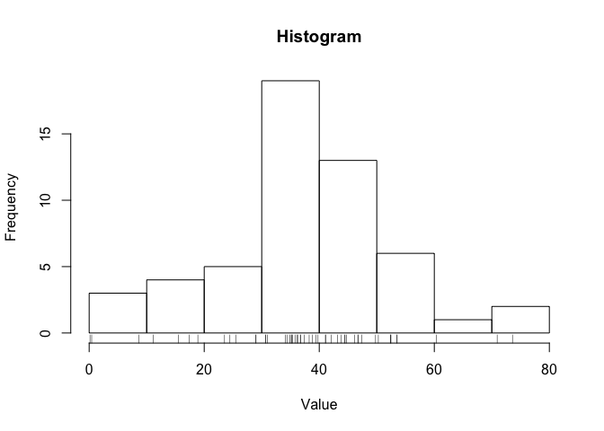
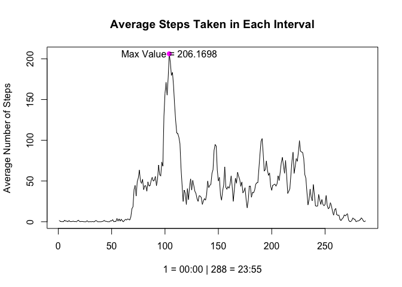
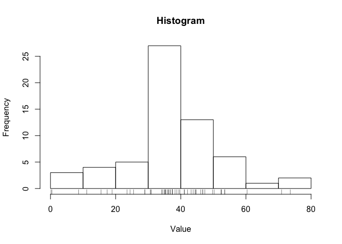
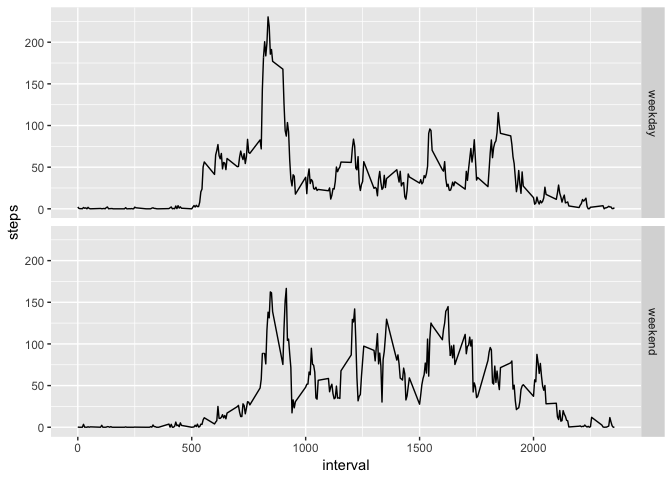

# Introduction
It is now possible to collect a large amount of data about personal movement using activity monitoring devices such as a Fitbit, Nike Fuelband, or Jawbone Up. These type of devices are part of the “quantified self” movement – a group of enthusiasts who take measurements about themselves regularly to improve their health, to find patterns in their behavior, or because they are tech geeks. But these data remain under-utilized both because the raw data are hard to obtain and there is a lack of statistical methods and software for processing and interpreting the data.

This assignment makes use of data from a personal activity monitoring device. This device collects data at 5 minute intervals through out the day. The data consists of two months of data from an anonymous individual collected during the months of October and November, 2012 and include the number of steps taken in 5 minute intervals each day.


*Loading the necessary R packages*

```r
library(ggplot2)
library(dplyr)
```

```
## 
## Attaching package: 'dplyr'
```

```
## The following objects are masked from 'package:stats':
## 
##     filter, lag
```

```
## The following objects are masked from 'package:base':
## 
##     intersect, setdiff, setequal, union
```

```r
library(tidyr)
```

# Analysis 

## Loading and preprocessing the data

### Read the data

```r
mydata <- read.csv("activity.csv")
```

### Data processing
Transform the date column into POSIXct

```r
mydata$date <- as.Date(mydata$date)
myd <- separate(data = mydata, col = interval, 
                into = c("hours", "minutes"), sep = -2)
#inserting 0 
emp <- myd$hours == ""
myd[emp, 3] <- "0"

#myd for hour/minute based factor operations
```


## What is mean total number of steps taken per day?
Ignoring NAs;

mean and sum of total number of steps taken per day


```r
mn0 <- with(mydata, tapply(steps, date, mean, na.rm = T))
sm0 <- with(mydata, tapply(steps, date, sum, na.rm = T))
md0 <- with(mydata, tapply(steps, date, median, na.rm = T))
print(sm0)
```

```
## 2012-10-01 2012-10-02 2012-10-03 2012-10-04 2012-10-05 2012-10-06 
##          0        126      11352      12116      13294      15420 
## 2012-10-07 2012-10-08 2012-10-09 2012-10-10 2012-10-11 2012-10-12 
##      11015          0      12811       9900      10304      17382 
## 2012-10-13 2012-10-14 2012-10-15 2012-10-16 2012-10-17 2012-10-18 
##      12426      15098      10139      15084      13452      10056 
## 2012-10-19 2012-10-20 2012-10-21 2012-10-22 2012-10-23 2012-10-24 
##      11829      10395       8821      13460       8918       8355 
## 2012-10-25 2012-10-26 2012-10-27 2012-10-28 2012-10-29 2012-10-30 
##       2492       6778      10119      11458       5018       9819 
## 2012-10-31 2012-11-01 2012-11-02 2012-11-03 2012-11-04 2012-11-05 
##      15414          0      10600      10571          0      10439 
## 2012-11-06 2012-11-07 2012-11-08 2012-11-09 2012-11-10 2012-11-11 
##       8334      12883       3219          0          0      12608 
## 2012-11-12 2012-11-13 2012-11-14 2012-11-15 2012-11-16 2012-11-17 
##      10765       7336          0         41       5441      14339 
## 2012-11-18 2012-11-19 2012-11-20 2012-11-21 2012-11-22 2012-11-23 
##      15110       8841       4472      12787      20427      21194 
## 2012-11-24 2012-11-25 2012-11-26 2012-11-27 2012-11-28 2012-11-29 
##      14478      11834      11162      13646      10183       7047 
## 2012-11-30 
##          0
```

Histogram of total number of steps taken per day:


```r
hist(mn0, xlab = "Value", 
     main = "Histogram")
rug(mn0)
```

<!-- -->

The mean of total steps taken per day

```r
mean(sm0)
```

```
## [1] 9354.23
```

The median of total steps taken per day

```r
median(sm0)
```

```
## [1] 10395
```


## What is the average daily activity pattern?
Ignoring NAs;

time series plot of number of steps taken per interval


```r
mn1 <- with(mydata, tapply(steps, interval, mean, na.rm = T))
plot(mn1, type = "l", xlab = "1 = 00:00 | 288 = 23:55",
     ylab = "Average Number of Steps", 
     main = "Average Steps Taken in Each Interval")
points(x = 104, y = 206.16, pch = 19, col = "magenta")
text(104, 206.16, "Max Value = 206.1698")
```

<!-- -->

Which interval contains max average number of steps == 08 : 35


```r
x <- mn1 > 206
mn1[x]
```

```
##      835 
## 206.1698
```


## Imputing missing values

Total number of missing values


```r
sum(is.na(mydata$steps))
```

```
## [1] 2304
```

Computing average of every interval

```r
mn2 <- aggregate(steps ~ interval, mydata, mean)
head(mn2)
```

```
##   interval     steps
## 1        0 1.7169811
## 2        5 0.3396226
## 3       10 0.1320755
## 4       15 0.1509434
## 5       20 0.0754717
## 6       25 2.0943396
```

The new dataset with imputed values


```r
im_dat <- mydata
for (i in 1:nrow(im_dat)) {
        if(is.na(im_dat$steps[i])){
                im_dat$steps[i] <- filter(mn2, 
                                          mn2$interval == im_dat$interval[i])[,2]
        }
}
```

Histogram of total number of steps taken each day


```r
im_mn0 <- with(im_dat, tapply(steps, date, mean, na.rm = T))
hist(im_mn0, xlab = "Value", 
     main = "Histogram")
rug(im_mn0)
```

<!-- -->

Mean of total number of steps taken per day


```r
im_sm0 <- with(im_dat, tapply(steps, date, sum, na.rm = T))
mean(im_sm0)
```

```
## [1] 10766.19
```

Median of total number of steps taken per day


```r
median(im_sm0)
```

```
## [1] 10766.19
```

Because the data is imputed by average of steps in each interval, the mean and 
median of total number of steps taken per day has changed.

```r
#original
summary(sm0)
```

```
##    Min. 1st Qu.  Median    Mean 3rd Qu.    Max. 
##       0    6778   10395    9354   12811   21194
```

```r
#imputed
summary(im_sm0)
```

```
##    Min. 1st Qu.  Median    Mean 3rd Qu.    Max. 
##      41    9819   10766   10766   12811   21194
```


## Are there differences in activity patterns between weekdays and weekends?

For this part, the function weekdays() will be used to extract a new factor 
variable with two levels of 'weekday' and 'weekend'


```r
#fill in the day of the week to new column
im_dat$daytype <- with(im_dat, weekdays(date))
#fill in weekday or weekend
for(i in 1:nrow(im_dat)){
      if(im_dat$daytype[i] == "Saturday" | im_dat$daytype[i] == "Sunday") {
        im_dat$daytype[i] <- "weekend"
      } else {
        im_dat$daytype[i] <- "weekday"
      }
}
#convert to factor
im_dat$daytype <- as.factor(im_dat$daytype)
str(im_dat)
```

```
## 'data.frame':	17568 obs. of  4 variables:
##  $ steps   : num  1.717 0.3396 0.1321 0.1509 0.0755 ...
##  $ date    : Date, format: "2012-10-01" "2012-10-01" ...
##  $ interval: int  0 5 10 15 20 25 30 35 40 45 ...
##  $ daytype : Factor w/ 2 levels "weekday","weekend": 1 1 1 1 1 1 1 1 1 1 ...
```

Plot of 5-minute interval(x-axis) average number of steps taken averaged across 
all weekdays or weekend days (y-axis)


```r
im_mn1 <- aggregate(steps ~ interval + daytype, im_dat, mean)

ggplot(im_mn1, aes(x = interval, 
                   y = steps)) + facet_grid(daytype ~.) + geom_line()
```

<!-- -->

